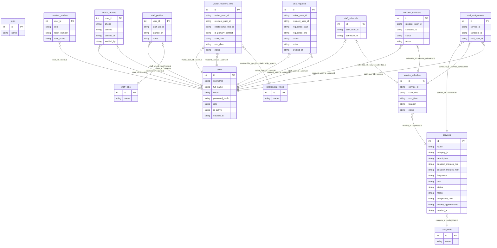

```mermaid
erDiagram
roles {
  int id PK
  string name
}
users {
  int id PK
  string username
  string full_name
  string email
  string password_hash
  string role
  string is_active
  string created_at
}
staff_jobs {
  int id PK
  string name
}
staff_profiles {
  int user_id PK
  string staff_job_id
  string started_on
  string notes
}
resident_profiles {
  int user_id PK
  string dob
  string room_number
  string care_notes
}
visitor_profiles {
  int user_id PK
  string phone
  string verified
  string verified_at
  string verified_by
}
relationship_types {
  int id PK
  string name
}
visitor_resident_links {
  int id PK
  string visitor_user_id
  string resident_user_id
  string relationship_type_id
  string is_primary_contact
  string start_date
  string end_date
  string notes
}
categories {
  int id PK
  string name
}
services {
  int id PK
  string name
  string category_id
  string description
  string duration_minutes_min
  string duration_minutes_max
  string frequency
  string cost
  string status
  string rating
  string completion_rate
  string weekly_appointments
  string created_at
}
service_schedule {
  int id PK
  string service_id
  string start_time
  string end_time
  string location
  string notes
}
staff_assignments {
  int id PK
  string service_id
  string schedule_id
  string staff_user_id
}
staff_schedule {
  int id PK
  string staff_user_id
  string schedule_id
}
resident_schedule {
  int id PK
  string resident_user_id
  string schedule_id
  string status
  string notes
}
visit_requests {
  int id PK
  string visitor_user_id
  string resident_user_id
  string requested_start
  string requested_end
  string status
  string notes
  string created_at
}
staff_profiles }o--|| users : "user_id→users.id"
resident_profiles }o--|| users : "user_id→users.id"
visitor_profiles }o--|| users : "user_id→users.id"
visitor_profiles }o--|| users : "verified_by→users.id"
staff_profiles }o--|| staff_jobs : "staff_job_id→staff_jobs.id"
visitor_resident_links }o--|| users : "visitor_user_id→users.id"
visitor_resident_links }o--|| users : "resident_user_id→users.id"
visitor_resident_links }o--|| relationship_types : "relationship_type_id→relationship_types.id"
services }o--|| categories : "category_id→categories.id"
service_schedule }o--|| services : "service_id→services.id"
staff_assignments }o--|| services : "service_id→services.id"
staff_assignments }o--|| service_schedule : "schedule_id→service_schedule.id"
staff_assignments }o--|| users : "staff_user_id→users.id"
staff_schedule }o--|| users : "staff_user_id→users.id"
staff_schedule }o--|| service_schedule : "schedule_id→service_schedule.id"
resident_schedule }o--|| users : "resident_user_id→users.id"
resident_schedule }o--|| service_schedule : "schedule_id→service_schedule.id"
visit_requests }o--|| users : "visitor_user_id→users.id"
visit_requests }o--|| users : "resident_user_id→users.id"
```